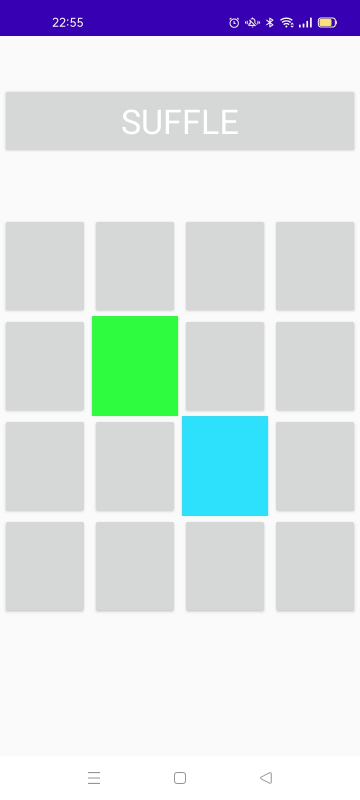

# Color Match — Original Project Materials

This page preserves the original screenshots, screen recording, and presentation from the first version of **Color Match**.

These materials are kept as a historical record of what the project looked like when I first learned to build an Android application with Java.

---

## Original App

### Screenshot

### Screen Recording

https://user-images.githubusercontent.com/58361477/158130880-91de1a78-dbc0-4dd3-9ad8-439f8915edd3.mp4

---

## Original Development Setup

### Java Environment

At the time, I installed the JDK and Android Studio and configured the Java environment variables on Windows.

### Android Version Selection

When creating the project, I selected an Android version compatible with the phone I was using.

### Files I Edited

The original project was a learning exercise. I only kept the files that I had directly modified instead of preserving the complete Android Studio project.

This screenshot shows those files in the original project:

---

## Original Presentation

The presentation created for the original project is also preserved in this repository:

[Open `Old_Presentation.pdf`](Old_Presentation.pdf)

---

## Historical Note

The original repository was not a complete buildable Android Studio project. It mainly preserved the materials and source files that I had personally worked on.

Years later, I returned to Color Match, rebuilt it as a complete Android project, fixed compatibility issues, tested it again on a real Android device, and documented the process in [`Troubleshooting_Log.md`](Troubleshooting_Log.md).

The materials on this page are intentionally left unchanged so the original version of the project can still be seen alongside the rebuilt version.
